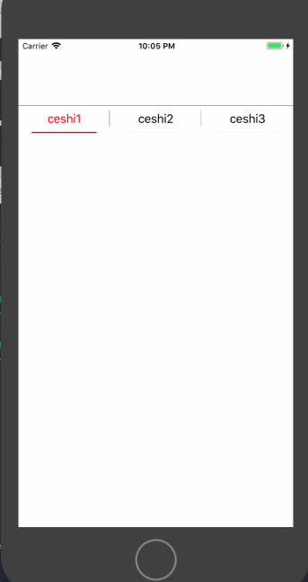

# SegmentView
视图切换

#### 一、效果图
 
 
 
 
#### 二、代码

    //2-1、创建
    self.segmentView = [[SegmentView alloc] initWithFrame:CGRectMake(0, 100, KCWidth, 40) titles:@[@"ceshi1",@"ceshi2",@"ceshi3"]];
	      self.seg.delegate = self;
	      __weak typeof(self) weakSelf = self;
	      [self.seg selectedIndexBlock:^(NSInteger index) {
		    NSLog(@"index==%zd",index);
		    [weakSelf.seg setSegmentUIWithIndex:index];
	      }];
    //2-2、添加子视图
	  [self.view addSubview:self.segmentView];
    
